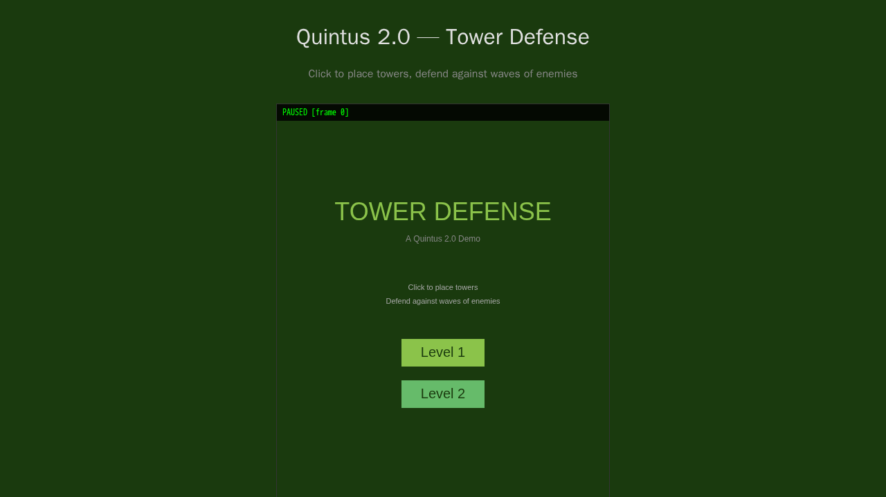
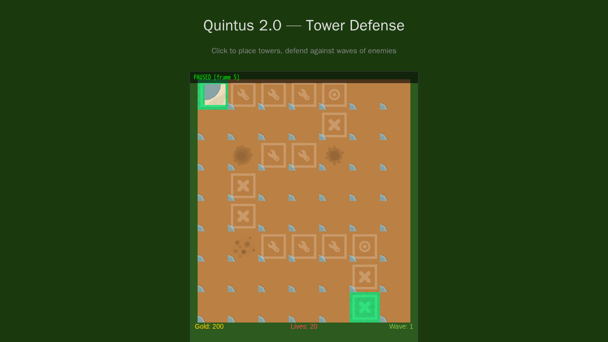
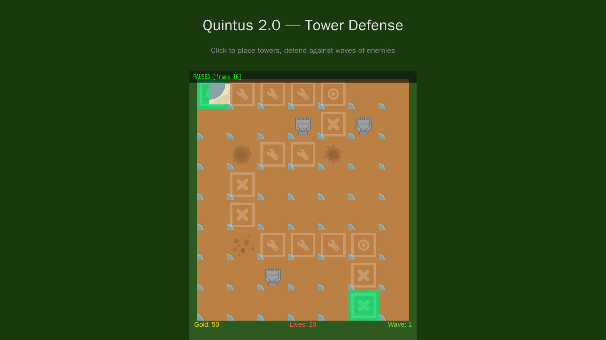
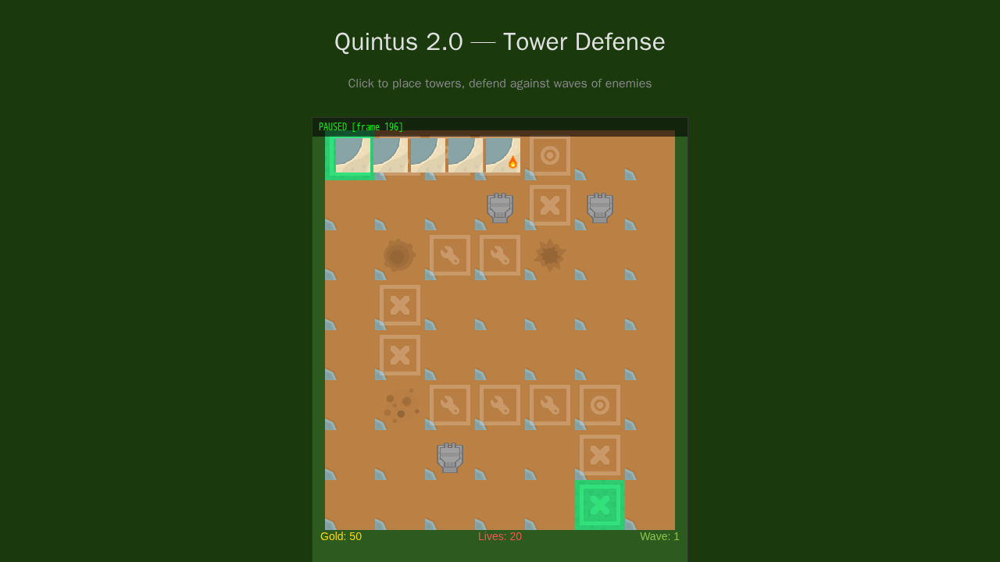
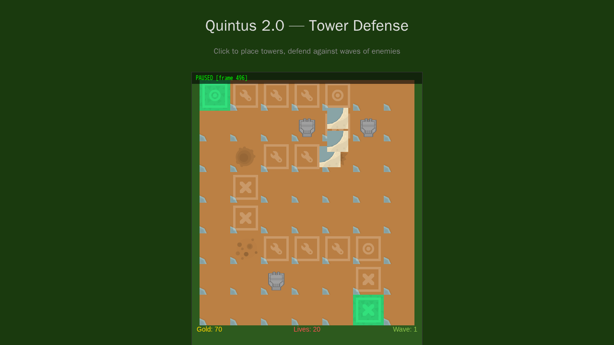
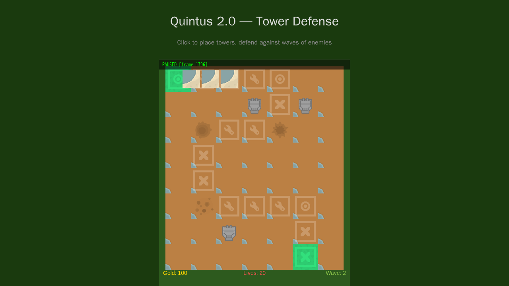
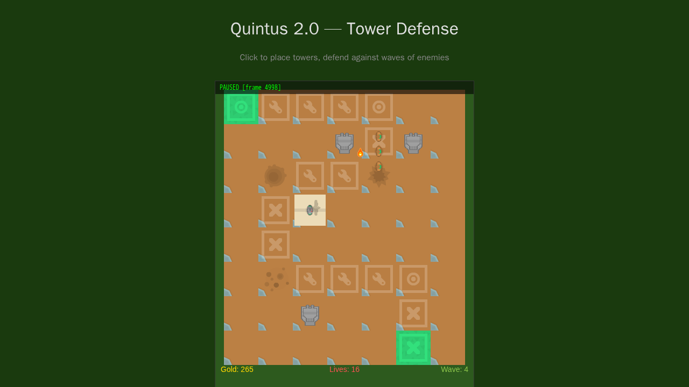
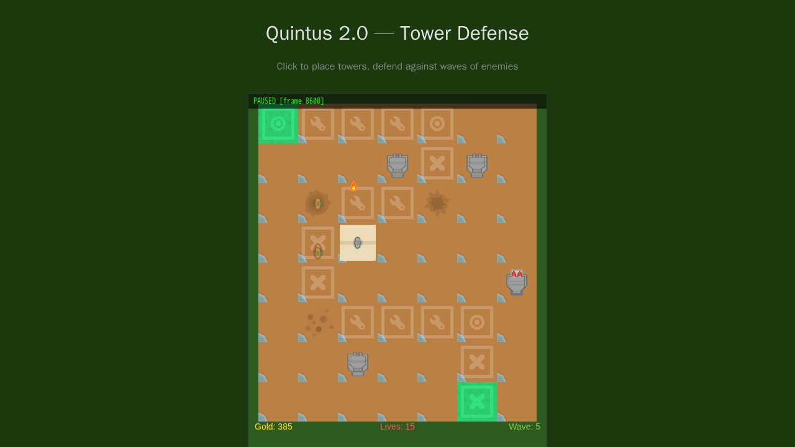
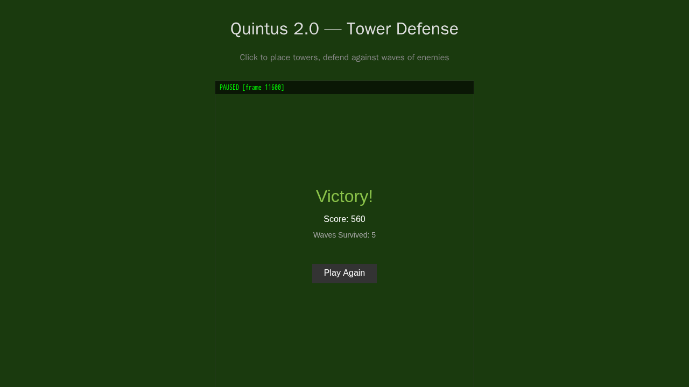

# Tower Defense — Gameplay Walkthrough

*Generated: Tuesday, February 25th, 2026*
*Source: 59b4da2 — Add tower defense example game with 29 tests*

## What Was Built

A grid-based tower defense game built with the Quintus 2.0 engine. Players defend a winding path from 5 waves of escalating enemy creeps by strategically placing three tower types: Arrow (single-target DPS), Cannon (splash damage), and Slow (speed debuff). The game features a reactive HUD displaying gold, lives, and wave progress, homing projectiles, and two distinct levels with different path layouts.

The tower defense example exercises the engine's physics system (Sensor-based range detection, Actor-based path following), JSX `build()` pattern for entity composition, reactive state for HUD updates, and the signal system for decoupled event handling (enemy death rewards, wave progression, game-over triggers).

## How to Play with qdbg

This walkthrough demonstrates a full Level 1 playthrough using the `qdbg` CLI debugger. All commands run from the project root.

### Prerequisites

- Dev server running: `pnpm dev` (port 3050)
- qdbg available: `pnpm qdbg --help`

### 1. Connect to the Game

```bash
pnpm qdbg connect tower-defense
```

The game opens paused at frame 0 on the title screen.



The title screen shows "TOWER DEFENSE — A Quintus 2.0 Demo" with Level 1 and Level 2 buttons.

### 2. Start Level 1

```bash
pnpm qdbg click-button "Level 1"
pnpm qdbg step 5
```

The level loads with:
- A 7x8 grid (64px cells) showing the S-curve enemy path
- **Gold: 200** (starting budget)
- **Lives: 20**
- **Wave: 1**



The green cell at top-left is the enemy **spawn point**. The green cell at bottom-right is the **exit**. Path tiles are marked with tool/gear icons. Enemies follow the path from spawn to exit.

### 3. Select and Place Towers

Tower placement uses two steps: select the tower type, then click a grid cell.

**Select tower type** (press hotkey):
```bash
pnpm qdbg tap tower_arrow 1    # Select Arrow Tower (cost: 50g)
# or
pnpm qdbg tap tower_cannon 1   # Select Cannon Tower (cost: 100g)
# or
pnpm qdbg tap tower_slow 1     # Select Slow Tower (cost: 75g)
```

**Place on the grid** (set mouse + tap select):
```bash
# Grid cell center = (16 + col*64 + 32, 16 + row*64 + 32)
# Example: place at grid (5, 1) → world (368, 112)
pnpm qdbg mouse 368 112
pnpm qdbg tap select 1
```

Place 3 arrow towers at strategic positions near path bends:

```bash
# Tower 1: grid (5,1) — covers the first horizontal run
pnpm qdbg tap tower_arrow 1
pnpm qdbg mouse 368 112
pnpm qdbg tap select 1

# Tower 2: grid (3,1) — covers mid-top path
pnpm qdbg mouse 240 112
pnpm qdbg tap select 1

# Tower 3: grid (2,6) — covers bottom path near exit
pnpm qdbg mouse 176 432
pnpm qdbg tap select 1
```



Gold drops from 200 to 50 after placing 3 arrow towers (50g each). The tower sprites appear as small turret icons on the grid.

### 4. Watch Wave 1

Advance frames to let the first wave spawn and play out:

```bash
pnpm qdbg step 180    # ~3 seconds — enemies spawn
```



Wave 1 sends 5 Basic Creeps (5 HP, 60 px/s, 10g reward each). They spawn at the top-left and march along the path. The arrow towers fire homing projectiles (orange dots) at enemies within range.

```bash
pnpm qdbg step 300    # ~5 more seconds — combat in progress
```



Towers engage enemies as they pass through range. Gold increases as enemies are defeated. Lives remain at 20 — no enemies have reached the exit yet.

### 5. Build More Defenses Between Waves

After Wave 1 clears, there's a 3-second delay before Wave 2. Use earned gold to reinforce:

```bash
pnpm qdbg step 900    # Advance through wave 1 completion + wave 2 start
```



Wave 2 is underway with Gold: 100 and Lives: 20. Place a slow tower to support the defense:

```bash
pnpm qdbg tap tower_slow 1
pnpm qdbg mouse 176 240     # grid (2,3)
pnpm qdbg tap select 1
```

### 6. Push Through Later Waves

Waves escalate in difficulty:

| Wave | Enemies | Composition |
|------|---------|-------------|
| 1 | 5 | Basic only |
| 2 | 7 | 4 Basic + 3 Fast |
| 3 | 10 | 5 Basic + 4 Fast + 1 Tank |
| 4 | 8 | 5 Fast + 3 Tank |
| 5 | 15 | 6 Basic + 5 Fast + 4 Tank |

```bash
pnpm qdbg step 3600    # Advance through waves 3-4
```



Wave 4 brings fast creeps and heavy tanks. Gold: 265, Lives: 15 — some enemies got through. Place a cannon tower for splash damage:

```bash
pnpm qdbg tap tower_cannon 1
pnpm qdbg mouse 432 304     # grid (6,4)
pnpm qdbg tap select 1
```

```bash
pnpm qdbg step 3600    # Push through wave 5
```



Wave 5 with 15 enemies including 4 tanks is the final challenge. Lives: 15 — the defense holds.

### 7. Victory!

After all 5 waves are cleared, the game transitions to the Game Over scene:

```bash
pnpm qdbg step 3000    # Finish remaining enemies
```



**Victory!** Final score: 560, Waves Survived: 5. The "Play Again" button returns to the title screen.

### 8. Disconnect

```bash
pnpm qdbg disconnect
```

## Tower Reference

| Tower | Cost | Range | Damage | Fire Rate | Special |
|-------|------|-------|--------|-----------|---------|
| Arrow | 50g | 140px | 1 | 1.0s | Single target |
| Cannon | 100g | 120px | 3 | 2.0s | Splash (50px radius) |
| Slow | 75g | 130px | 0 | 1.5s | 40% slow for 2.0s |

## Enemy Reference

| Enemy | Speed | HP | Gold Reward |
|-------|-------|----|-------------|
| Basic Creep | 60 px/s | 5 | 10g |
| Fast Creep | 120 px/s | 3 | 15g |
| Tank Creep | 35 px/s | 15 | 25g |

## Key qdbg Patterns for Tower Defense

**Grid coordinate conversion:**
```
world_x = 16 + col * 64 + 32
world_y = 16 + row * 64 + 32
```

**Tower placement sequence:**
```bash
pnpm qdbg tap tower_arrow 1     # Select type
pnpm qdbg mouse <x> <y>         # Aim at grid cell
pnpm qdbg tap select 1          # Place
```

**Useful inspection commands:**
```bash
pnpm qdbg query ArrowTower      # Find all arrow towers
pnpm qdbg query BasicCreep      # Find all basic enemies
pnpm qdbg events --category=physics   # Watch collision events
pnpm qdbg status                # Check frame/time/pause state
```

## Files Changed

| File | Change |
|------|--------|
| `examples/tower-defense/main.ts` | Game setup, plugins, scene registration, asset loading |
| `examples/tower-defense/config.ts` | Grid dimensions, tower/enemy stats, economy constants |
| `examples/tower-defense/state.ts` | Reactive game state (gold, lives, wave, selectedTower) |
| `examples/tower-defense/path.ts` | Path definitions, grid-to-world conversion |
| `examples/tower-defense/scenes/title-scene.tsx` | Title menu with Level 1/2 buttons |
| `examples/tower-defense/scenes/td-level.tsx` | Base level class (terrain, path rendering, managers) |
| `examples/tower-defense/scenes/level1.tsx` | Level 1 S-curve path (7 waypoints) |
| `examples/tower-defense/scenes/level2.tsx` | Level 2 winding path (8 waypoints) |
| `examples/tower-defense/scenes/game-over-scene.tsx` | Victory/loss screen with score |
| `examples/tower-defense/entities/tower-base.tsx` | Tower AI (range detection, targeting, firing) |
| `examples/tower-defense/entities/arrow-tower.tsx` | Arrow tower (single-target) |
| `examples/tower-defense/entities/cannon-tower.tsx` | Cannon tower (splash damage) |
| `examples/tower-defense/entities/slow-tower.tsx` | Slow tower (speed debuff) |
| `examples/tower-defense/entities/path-follower.tsx` | Enemy base class (waypoint following, slow effect) |
| `examples/tower-defense/entities/basic-creep.tsx` | Basic enemy type |
| `examples/tower-defense/entities/fast-creep.tsx` | Fast enemy type |
| `examples/tower-defense/entities/tank-creep.tsx` | Tank enemy type |
| `examples/tower-defense/entities/projectile.tsx` | Homing projectile with splash support |
| `examples/tower-defense/entities/placement-manager.ts` | Grid validation and tower spawning |
| `examples/tower-defense/entities/wave-manager.ts` | Wave progression and enemy spawning |
| `examples/tower-defense/hud/hud.tsx` | HUD overlay (gold, lives, wave, tower hotkeys) |
| `examples/tower-defense/__tests__/*.test.ts` | 29 integration tests |
