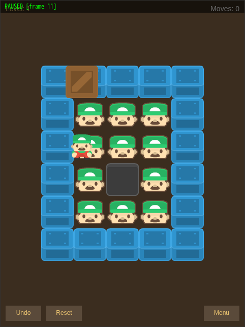
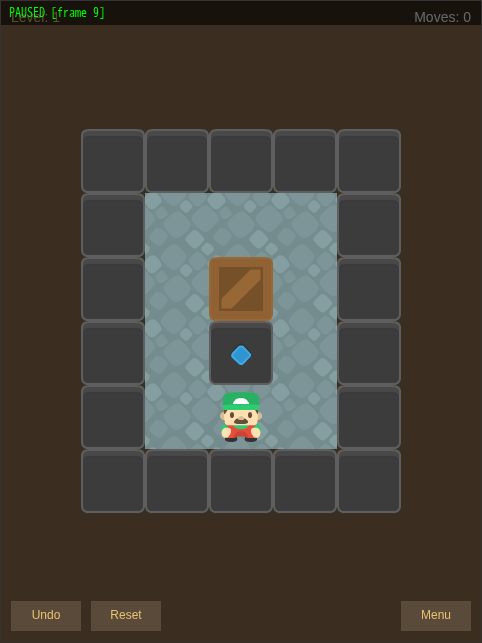
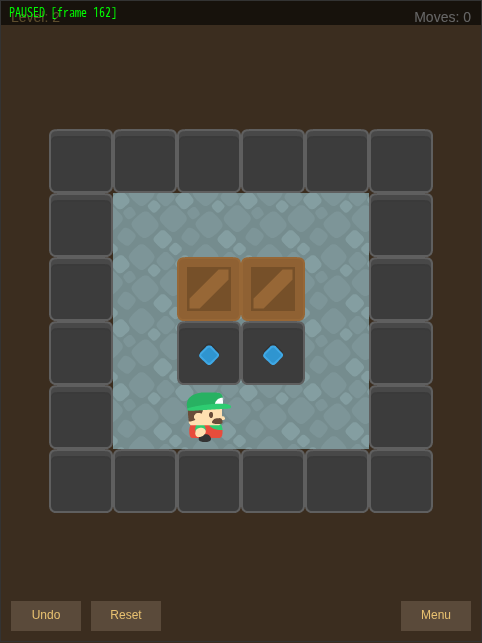
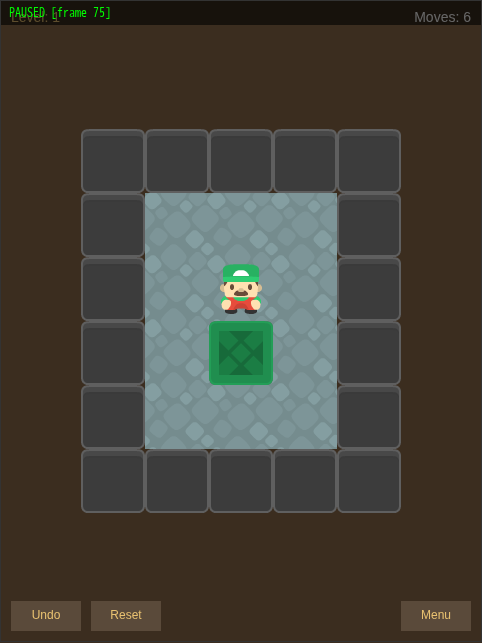
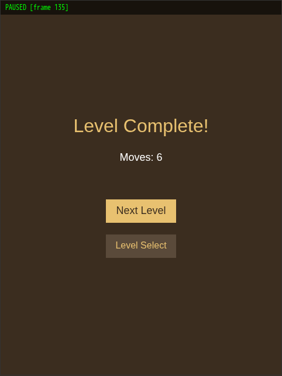
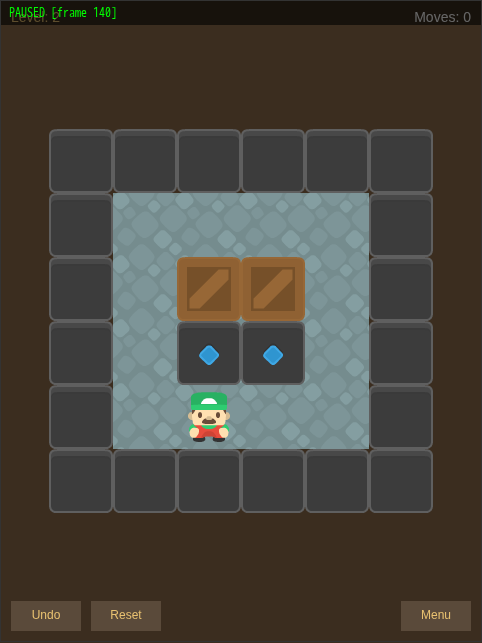
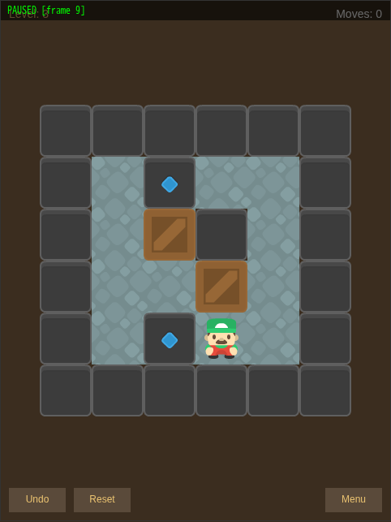
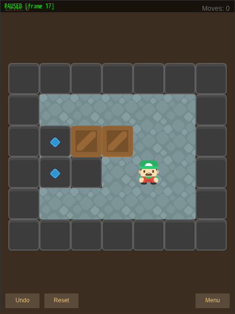
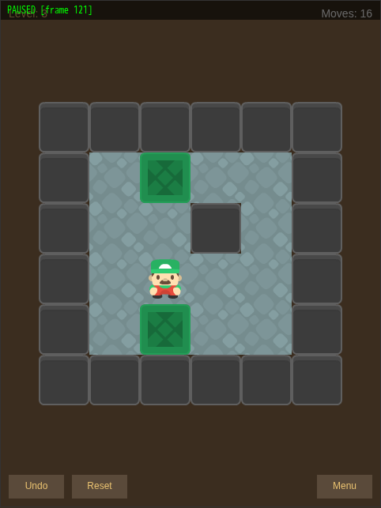
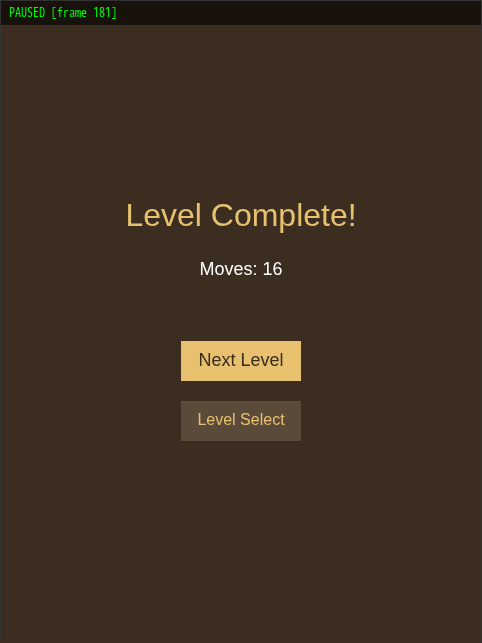

# Sokoban Game Debug & Visual Fixes

*Generated: Wednesday, February 26th, 2026*
*Source: Current WIP (fixes applied to `examples/sokoban/`)*

## What Was Built

The Sokoban example game (Phase 6 of the Phase 9 design) had two critical visual bugs that made the game unplayable:

1. **Wrong tile sprites** — The frame indices in `sprites.ts` were mapped incorrectly to the `tileset.png` grid. Walls rendered as blue crate sprites, floors rendered as player character sprites, and the target marker rendered as a dark wall block. The `tile_description.csv` created during Phase 1 asset preparation had systematic misidentifications of the Kenney Sokoban tileset grid layout.

2. **Position offset bug** — Player and crate sprites were direct children of the Scene, but `snapTo()` overwrote the centering offset that was set on their position. The grid renderer worked correctly because its tile children inherited the parent's transform, but the player and crates rendered at grid-local coordinates without the screen-centering offset applied. This caused entities to appear shifted from their correct grid positions.

Both visual bugs were identified using the `qdbg` CLI debugger, which allowed frame-by-frame inspection of the tileset grid with numbered overlays to identify correct frame indices. A third bug — unsolvable levels 3 and 5 — was confirmed using a BFS solver that exhaustively searched all reachable game states.

## Files Changed

| File | Change |
|------|--------|
| `examples/sokoban/sprites.ts` | Fixed frame indices: FRAME_WALL 8→11, FRAME_FLOOR 72→89, FRAME_TARGET 11→50, FRAME_CRATE_ON_TARGET 28→17 |
| `examples/sokoban/scenes/sokoban-level.tsx` | Fixed position offset bug: added Node2D container at grid offset, parent all game entities to it |
| `examples/sokoban/levels.ts` | Replaced unsolvable Level 3 and Level 5 with BFS-verified solvable designs |

## Bugs Found & Fixed

### Bug 1: Wrong Tile Frame Indices

**Root cause:** The `tile_description.csv` from Phase 1 asset preparation incorrectly mapped the Kenney Sokoban `tileset.png` grid (13×8 at 64px). The CSV's frame-to-role assignments didn't match the actual tile positions in the image.

**Before (wrong frames):**

| Role | Frame | Actually Shows |
|------|-------|---------------|
| Wall | 8 | Blue crate top with X-pattern |
| Floor | 72 | Player face sprite |
| Target | 11 | Dark grey wall block |
| Crate on target | 28 | Red small crate |

**After (correct frames):**

| Role | Frame | Shows |
|------|-------|-------|
| Wall | 11 | Dark grey/charcoal wall block |
| Floor | 89 | Grey stone mosaic pattern |
| Target | 50 | Blue diamond on dark background |
| Crate on target | 17 | Green X-pattern crate (green = solved) |

Player frames (52, 65, 78, 91) and standard crate frame (14) were already correct.


*Before: Walls show as blue crates, floor shows as character sprites*


*After: Walls are dark grey, floor is stone, target is blue diamond*

### Bug 2: Position Offset Lost by snapTo()

**Root cause:** The `SokobanLevel.onReady()` method set `position._set(offsetX, offsetY)` on PlayerSprite and CrateSprite, then immediately called `snapTo()` which overwrites the position entirely. The grid centering offset was lost.

```typescript
// BEFORE (broken):
this._playerSprite.position._set(offsetX, offsetY);  // offset set
this._playerSprite.snapTo(2, 4);  // offset overwritten!
this.addChild(this._playerSprite);  // child of scene at (0,0)

// AFTER (fixed):
const container = new Node2D();
container.position._set(offsetX, offsetY);  // offset on container
this.addChild(container);
this._playerSprite.snapTo(2, 4);  // local position within container
container.addChild(this._playerSprite);  // inherits container transform
```

### Bug 3: Unsolvable Levels (3 and 5)

**Root cause:** The original Level 3 and Level 5 had layouts where crates could never reach all targets. A BFS solver exhaustively explored all reachable states and confirmed neither level has a solution.

**Level 3 (original):** Crate at grid position (2,2) cannot be pushed down to target at (2,3) because position (2,1) is a wall — the player can never stand there to push. With the wall at (3,3) also blocking rightward pushes, the crate is permanently stuck. BFS explored 651 states, no solution found.

**Level 5 (original):** Target at (4,4) is completely unreachable. Every adjacent cell from which a crate could be pushed onto it is a wall. BFS explored 60 states, no solution found.

**Replacements (BFS-verified solvable):**

| Level | Layout | Optimal Moves | States Explored |
|-------|--------|---------------|-----------------|
| 3 (new) | 6×6 room with internal wall, 2 crates | 16 | 298 |
| 5 (new) | 7×6 wide room with internal wall, 2 crates | 19 | 819 |

**Level 3 solution:** L U U D D R R U L D L L U U R D
**Level 5 solution:** U U L D L U L D R R R D D L U R U L L

## How to Test

### Prerequisites

- `pnpm install` completed
- Dev server running or available (`pnpm dev`)

### Test Steps

#### 1. Run Automated Tests

```bash
npx vitest run --config examples/sokoban/vitest.config.ts
```

**Expected**: All 39 tests pass across 6 test files (grid, levels, push, movement, undo, flow).

#### 2. Visual Verification — Level 1

```bash
pnpm qdbg connect sokoban
pnpm qdbg step 1
pnpm qdbg click-button Start
pnpm qdbg step 3
pnpm qdbg click-button 1
pnpm qdbg step 5
pnpm qdbg screenshot
```

**Expected**: Level 1 shows:
- Dark grey wall border (5 wide × 6 tall)
- Grey stone floor interior
- Brown wooden crate centered, one row below the top floor row
- Blue diamond target directly below the crate
- Player character at the bottom of the floor area


#### 3. Test Movement & Undo

```bash
pnpm qdbg tap move_left 1 && pnpm qdbg step 10
pnpm qdbg tap undo 1 && pnpm qdbg step 10
```

**Expected**: Player moves left (Moves: 1), then undo returns to start (Moves: 0).



#### 4. Solve Level 1

Navigate around the crate and push it down onto the target:
```bash
pnpm qdbg tap move_left 1 && pnpm qdbg step 10
pnpm qdbg tap move_up 1 && pnpm qdbg step 10
pnpm qdbg tap move_up 1 && pnpm qdbg step 10
pnpm qdbg tap move_up 1 && pnpm qdbg step 10
pnpm qdbg tap move_right 1 && pnpm qdbg step 10
pnpm qdbg tap move_down 1 && pnpm qdbg step 10
```

**Expected**: Crate turns green when on target. "Level Complete!" screen shows after 0.5s.




#### 5. Check Level 2 (Multiple Crates)

Click "Next Level" from the complete screen.

**Expected**: Two brown crates, two blue diamond targets, player below.



#### 6. Check Level 3 (Internal Wall)

Navigate to Level Select → Level 3.

**Expected**: 6×6 room with internal wall block, two brown crates, two blue diamond targets, player at bottom-right.



#### 7. Check Level 5 (Wide Room)

Navigate to Level Select → Level 5.

**Expected**: 7×6 room with internal wall, two crates side by side, two targets on left wall, player on right.



#### 8. Solve Level 3

Optimal solution (16 moves): L U U D D R R U L D L L U U R D

**Expected**: Both crates turn green, "Level Complete!" shows Moves: 16.




#### 9. Cleanup

```bash
pnpm qdbg disconnect
```

## Diagnostic Screenshots

These screenshots were captured during the debugging process:

| Screenshot | Purpose |
|-----------|---------|
| `04-tileset-grid.png` | Full tileset rendered with frame numbers overlaid |
| `05-candidate-frames.png` | Wall/floor/target candidates at full size |
| `06-walls-targets-frames.png` | Additional wall and target frame candidates |
| `07-final-candidates.png` | Final labeled comparison of all tile candidates |
| `08-crate-variants.png` | Crate color variants for standard vs solved state |
