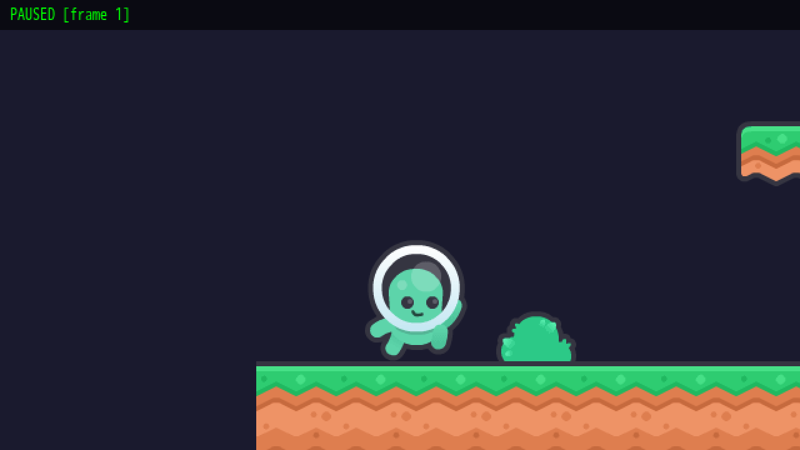
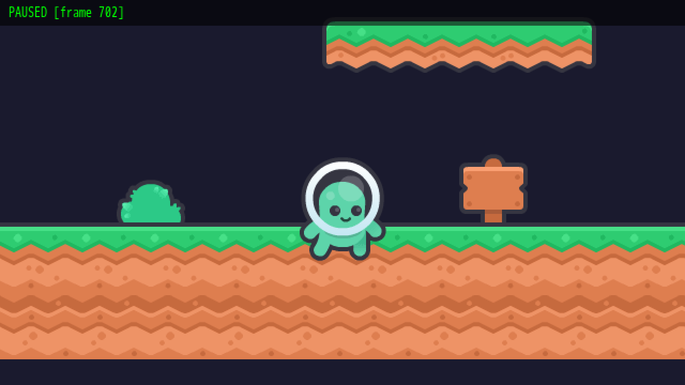
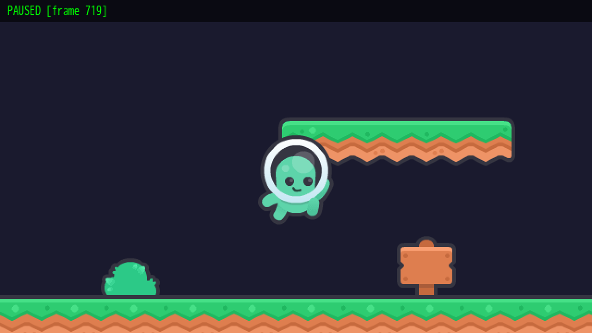
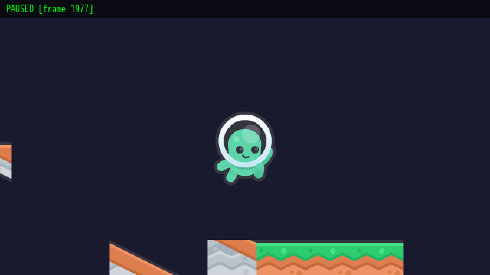
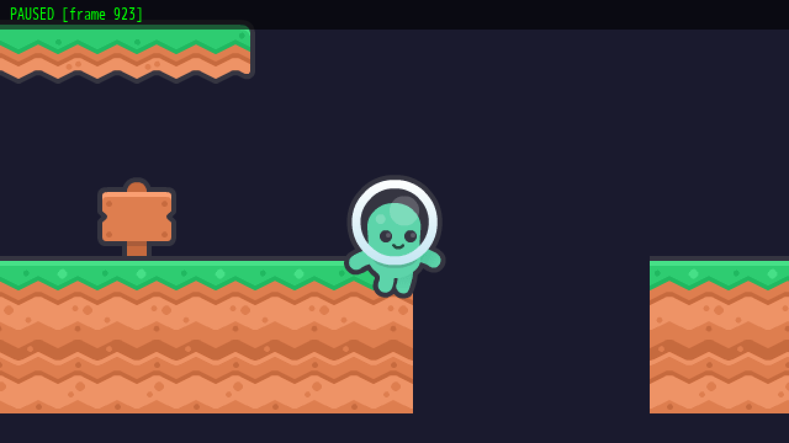
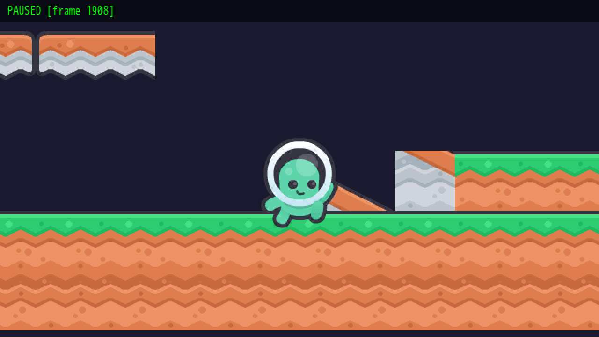
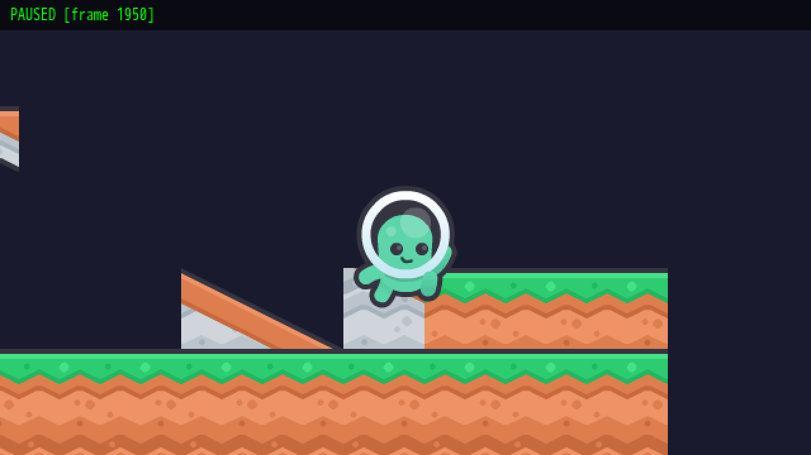
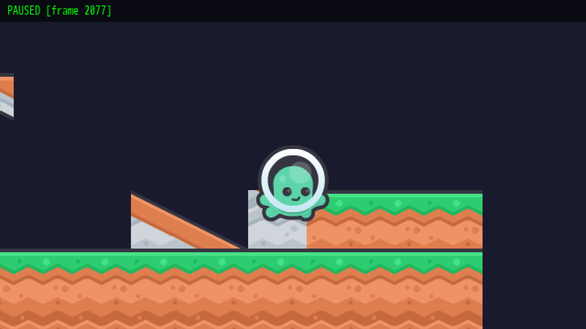
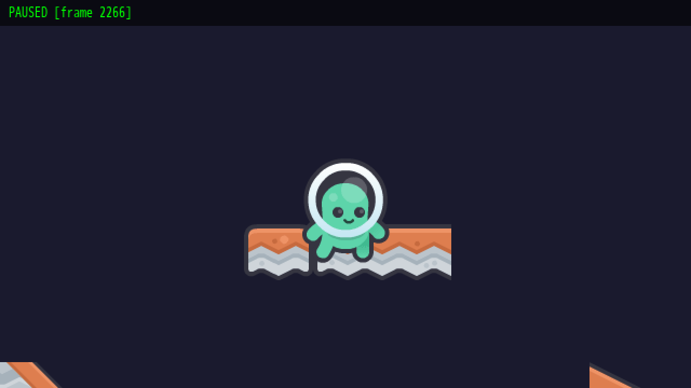

# Advanced Platformer — Phases 1–4

*Generated: Saturday, March 1st, 2026*
*Source: Commits 3b3fbd3..83c8035 (4 commits)*

## What Was Built

The Advanced Platformer is the flagship Quintus engine demo, designed to showcase the Kenney New Platformer Pack 1.1 with a feature-rich 2D platformer. Phases 1–4 establish the engine enhancements, asset pipeline, player character, and terrain collision systems that all future phases build upon.

**Phase 1 (Engine Enhancements)** added five targeted engine features: `SpriteSheet.fromAtlas()` for atlas-based animations, TileMap query APIs (`getTileDefinition`, `getTileIdsByProperty`, `getTileIdsByType`), animated tile rendering, per-tile polygon collision generation via `createTileShapeColliders()`, and the `visibleLayers` filter for TileMap rendering.

**Phase 2 (Asset Pipeline & Tiled Setup)** copied and organized all Kenney assets (3 sprite sheets, 9 background images, 10 sound effects), created the `sprites.ts` atlas/animation definitions, built a comprehensive Tiled tileset (`tileset.tsx`) with 324 tiles including type tags, one-way properties, slope collision polygons, and animated tiles, plus a template level.

**Phase 3 (Player Mechanics)** implemented the full `Player` class with horizontal movement, jumping, double-jumping, ducking, ladder climbing state, star power invincibility, fall death, and an animation state machine that transitions between idle/walk/jump/duck/climb/hit sprites.

**Phase 4 (Terrain & Collision)** wired up slope collision (polygon colliders from Tiled's per-tile objectgroup), one-way platforms (cloud tiles with `oneWay=true` property), and the `TestScene` that loads the TMX map, generates all collision types, positions the player at a spawn point, and configures camera follow.

Two bugs were discovered and fixed during testing:
1. **Vite `.tsx` conflict** — Tiled's external tileset format uses `.tsx` which Vite intercepted as TypeScript JSX, returning 500. Fixed with a Vite plugin that serves `.tsx` files in `/assets/` directories as plain XML.
2. **Orphan `ref="camera"`** — `TestScene.build()` had `ref="camera"` on the Camera node but no corresponding property on the class. Removed the ref since the camera is accessed via `findFirst(Camera)`.

## Files Changed

### Engine Enhancements (Phase 1)

| File | Change |
|------|--------|
| `packages/sprites/src/sprite-sheet.ts` | Added `SpriteSheet.fromAtlas()` factory + `AtlasAnimationConfig` type |
| `packages/tilemap/src/tilemap.ts` | Added `getTileDefinition()`, `getTileIdsByProperty()`, `getTileIdsByType()`, `visibleLayers` filter, animated tile rendering |
| `packages/tilemap/src/tile-collision.ts` | Added `createTileShapeColliders()` for per-tile polygon/rect colliders |
| `packages/tilemap/src/tilemap.test.ts` | 25 new tests for tile query APIs, visible layers, animated tiles |
| `packages/tilemap/src/tile-collision.test.ts` | 15 new tests for slope collision generation |
| `packages/sprites/src/sprite-sheet.test.ts` | 10 new tests for `fromAtlas()` |

### Asset Pipeline & Tiled Setup (Phase 2)

| File | Change |
|------|--------|
| `examples/advanced-platformer/assets/` | All Kenney assets: tiles, characters, enemies, backgrounds, sounds |
| `examples/advanced-platformer/assets/tileset.tsx` | 1096-line Tiled tileset with types, properties, collision polygons |
| `examples/advanced-platformer/assets/level1.tmx` | Template level (40x10 tiles, 3 layers + objects) |
| `examples/advanced-platformer/sprites.ts` | TextureAtlas loading, 6 SpriteSheet definitions, frame constants |
| `examples/advanced-platformer/config.ts` | Collision groups and input bindings |
| `examples/advanced-platformer/state.ts` | Reactive game state (score, coins, health, lives, keys, star power) |
| `examples/advanced-platformer/main.ts` | Game setup, plugin registration, asset loading |
| `examples/advanced-platformer/index.html` | HTML entry point |

### Player Mechanics (Phase 3)

| File | Change |
|------|--------|
| `examples/advanced-platformer/entities/player.tsx` | Full Player class (236 lines) with all movement states |
| `examples/advanced-platformer/__tests__/player.test.ts` | 12 tests for movement, jumping, ducking, damage, death |
| `examples/advanced-platformer/__tests__/helpers.tsx` | 366-line test helper with mock scenes, slope arenas, input utilities |

### Terrain & Collision (Phase 4)

| File | Change |
|------|--------|
| `examples/advanced-platformer/scenes/test-scene.tsx` | TestScene with TileMap, collision generation, player spawn, camera |
| `examples/advanced-platformer/__tests__/terrain.test.ts` | 8 tests for slopes (45°, shallow, flipped) and one-way platforms |

### Bug Fixes

| File | Change |
|------|--------|
| `examples/vite.config.ts` | Added `serve-tiled-tsx` plugin to serve `.tsx` assets as XML |
| `examples/advanced-platformer/scenes/test-scene.tsx` | Removed orphan `ref="camera"` from Camera JSX |

## How to Test

### Prerequisites

- Node.js 22+, pnpm installed
- `pnpm install` and `pnpm build` completed

### Test Steps

#### 1. Run the automated test suite

```bash
pnpm test
```

All 2024 tests should pass, including:
- **12 player tests** — movement, jumping, double jump, ducking, damage, death, invincibility
- **8 terrain tests** — slope walking (45°, shallow, flipped), one-way platforms
- **25 tilemap tests** — query APIs, visible layers, animated tiles
- **15 tile-collision tests** — polygon collider generation, flip handling

**Expected**: 121 test files, 2024 tests passed, no errors.

#### 2. Launch the game in the browser

```bash
pnpm dev
# Navigate to http://localhost:3050/advanced-platformer/
```

**Expected**: The game loads with no console errors (except harmless favicon 404). The green astronaut character appears on a grass terrain level.



#### 3. Test player walking

Use arrow keys or WASD to move left/right. The player slides smoothly along the ground with a walking animation.



#### 4. Test jumping and double-jump

Press Space to jump. While in the air, press Space again for a double-jump. The player should reach significantly higher on the second jump.





#### 5. Test the gap

Walk to the right until you reach the gap in the terrain. Jump across it. Falling into the gap triggers fall death (y > 800).



#### 6. Test slope walking

Continue right past the second ground section to find the slope tiles. Walk up the diagonal slope — the player should ascend smoothly, remaining on the floor surface.





#### 7. Test ducking

Press the down arrow or S key while on the ground. The player should crouch with a duck animation.



#### 8. Test one-way platforms

Jump underneath the grey cloud platforms. The player should pass through them from below. When falling back down, the player should land on top of them.



#### 9. Test with qdbg (CLI debugger)

```bash
pnpm qdbg connect advanced-platformer
pnpm qdbg tree          # Verify scene tree structure
pnpm qdbg physics Player  # Check player physics state
pnpm qdbg tap jump 1    # Test jump input
pnpm qdbg step 30       # Advance time
pnpm qdbg disconnect
```

## Test Coverage Summary

| Area | Tests | Status |
|------|-------|--------|
| `SpriteSheet.fromAtlas()` | 10 | Pass |
| TileMap query APIs | 12 | Pass |
| TileMap animated tiles | 5 | Pass |
| TileMap visible layers | 3 | Pass |
| Tile shape colliders | 15 | Pass |
| Player movement | 6 | Pass |
| Player damage/death | 6 | Pass |
| Slope collision (45°) | 3 | Pass |
| Slope collision (shallow) | 2 | Pass |
| Slope collision (flipped) | 1 | Pass |
| One-way platforms | 2 | Pass |
| **Total** | **65** | **All pass** |
